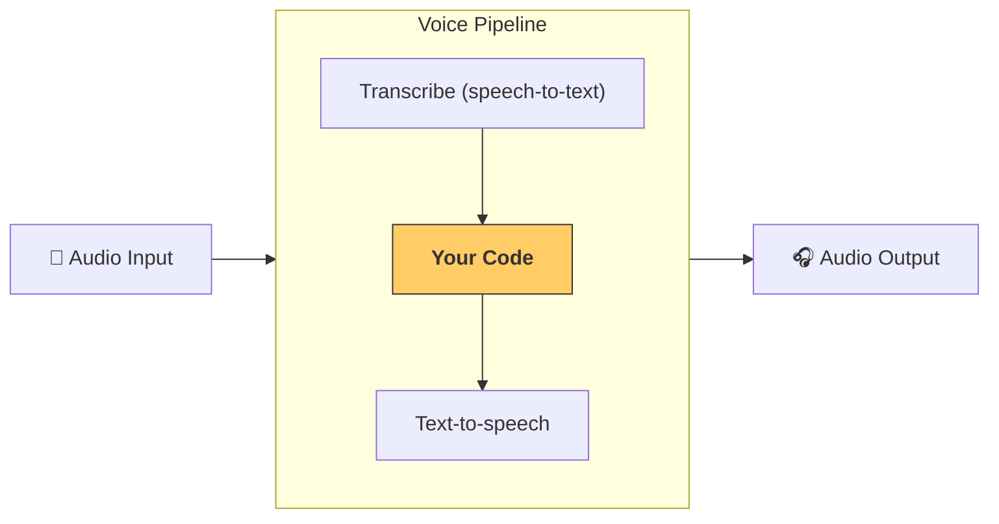

---
search:
  exclude: true
---
# パイプラインとワークフロー

` VoicePipeline ` は、エージェント型ワークフローを音声アプリへ簡単に変換できるクラスです。実行したいワークフローを渡すと、入力音声の文字起こし、音声終了の検知、適切なタイミングでのワークフロー呼び出し、そしてワークフロー出力を音声へ戻す処理を自動で行います。



## パイプラインの設定

パイプライン作成時には次の項目を設定できます。

1. ` workflow ` : 新しい音声が文字起こしされるたびに実行されるコード（[`workflow`][agents.voice.workflow.VoiceWorkflowBase]）。
2. 使用する ` speech-to-text ` と ` text-to-speech ` モデル（[`speech-to-text`][agents.voice.model.STTModel]、[`text-to-speech`][agents.voice.model.TTSModel]）。
3. ` config ` : 以下のような項目を設定できる [`config`][agents.voice.pipeline_config.VoicePipelineConfig]。
    - モデルプロバイダー。モデル名をモデルへマッピングします。
    - トレーシング。トレーシングを無効化するかどうか、音声ファイルのアップロード有無、ワークフロー名、トレース ID など。
    - TTS と STT モデルの設定。プロンプト、言語、データ型など。

## パイプラインの実行

パイプラインは [`run()`][agents.voice.pipeline.VoicePipeline.run] メソッドで実行できます。音声入力は 2 つの形式で渡せます。

1. [`AudioInput`][agents.voice.input.AudioInput]  
   完全な音声トランスクリプトがある場合に使用します。話者が話し終えたタイミングを検知する必要がない状況、たとえば事前録音音声やプッシュ・トゥ・トーク アプリなどに適しています。
2. [`StreamedAudioInput`][agents.voice.input.StreamedAudioInput]  
   話者が話し終えたかどうかを検知する必要がある場合に使用します。音声チャンクを検出次第プッシュでき、パイプラインが「アクティビティ検知」と呼ばれるプロセスを通じて適切なタイミングでワークフローを自動実行します。

## 結果

音声パイプライン実行の結果は [`StreamedAudioResult`][agents.voice.result.StreamedAudioResult] です。これはイベントを逐次ストリームできるオブジェクトで、以下のような [`VoiceStreamEvent`][agents.voice.events.VoiceStreamEvent] が発生します。

1. [`VoiceStreamEventAudio`][agents.voice.events.VoiceStreamEventAudio]  
   音声チャンクを含みます。
2. [`VoiceStreamEventLifecycle`][agents.voice.events.VoiceStreamEventLifecycle]  
   ターン開始や終了などライフサイクルイベントを通知します。
3. [`VoiceStreamEventError`][agents.voice.events.VoiceStreamEventError]  
   エラーイベントです。

```python

result = await pipeline.run(input)

async for event in result.stream():
    if event.type == "voice_stream_event_audio":
        # play audio
    elif event.type == "voice_stream_event_lifecycle":
        # lifecycle
    elif event.type == "voice_stream_event_error"
        # error
    ...
```

## ベストプラクティス

### 割り込み

Agents SDK には現在、` StreamedAudioInput ` 用の組み込みの割り込み処理はありません。そのため検出された各ターンごとにワークフローが個別に実行されます。アプリケーション側で割り込み処理を行いたい場合は [`VoiceStreamEventLifecycle`][agents.voice.events.VoiceStreamEventLifecycle] を監視してください。  
- ` turn_started ` は新しいターンが文字起こしされ、処理が始まったことを示します。  
- ` turn_ended ` は該当ターンの音声がすべて送信された後に発火します。  

モデルがターンを開始した際にマイクをミュートし、ターン関連の音声をすべてフラッシュした後にアンミュートする、といった制御にこれらのイベントを活用できます。