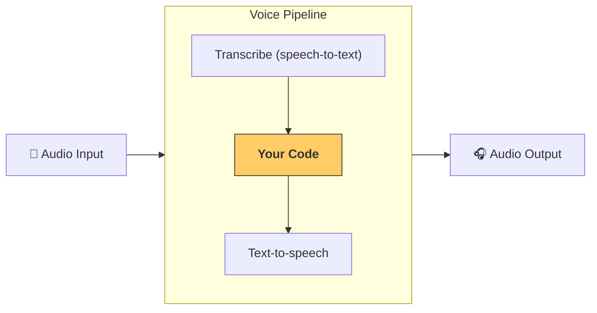

---
search:
  exclude: true
---
# パイプラインとワークフロー

[`VoicePipeline`][agents.voice.pipeline.VoicePipeline] クラスは、エージェントベースのワークフローを音声アプリへ簡単に変換できます。ワークフローを渡すだけで、入力音声の文字起こし、音声の終了検知、適切なタイミングでのワークフロー実行、そしてワークフロー出力を音声へ変換する処理までをパイプラインが自動で行います。



## パイプラインの設定

パイプラインを作成する際に、次の項目を設定できます。

1. [`workflow`][agents.voice.workflow.VoiceWorkflowBase] — 新しい音声が文字起こしされるたびに実行されるコード  
2. [`speech-to-text`][agents.voice.model.STTModel] と [`text-to-speech`][agents.voice.model.TTSModel] モデル  
3. [`config`][agents.voice.pipeline_config.VoicePipelineConfig] — 以下のような設定を含みます  
    - モデルプロバイダー: モデル名をモデルにマッピング  
    - トレーシング: トレーシングの無効化、音声ファイルのアップロード有無、ワークフロー名、トレース ID など  
    - TTS / STT モデルの設定: プロンプト、言語、データ型 など

## パイプラインの実行

パイプラインは [`run()`][agents.voice.pipeline.VoicePipeline.run] メソッドで実行でき、音声入力を次の 2 形式で渡せます。

1. [`AudioInput`][agents.voice.input.AudioInput] — 既に音声全体の文字起こしがあり、その結果に対してただちに処理を行いたい場合に使用します。録音済み音声や、ユーザーが話し終わるタイミングが明確なプッシュ・トゥ・トーク型アプリなど、話者の終了検知が不要なケースに便利です。  
2. [`StreamedAudioInput`][agents.voice.input.StreamedAudioInput] — ユーザーが話し終わったかを検知する必要がある場合に使用します。音声チャンクを検出次第プッシュでき、パイプラインが「アクティビティ検知」を通じて適切なタイミングでエージェントワークフローを自動実行します。

## 結果

音声パイプラインの実行結果は [`StreamedAudioResult`][agents.voice.result.StreamedAudioResult] です。このオブジェクトにより、発生するイベントをストリーミング形式で受け取れます。いくつかの [`VoiceStreamEvent`][agents.voice.events.VoiceStreamEvent] 種類があります。

1. [`VoiceStreamEventAudio`][agents.voice.events.VoiceStreamEventAudio] — 音声チャンクを含みます。  
2. [`VoiceStreamEventLifecycle`][agents.voice.events.VoiceStreamEventLifecycle] — ターンの開始や終了などライフサイクルイベントを通知します。  
3. [`VoiceStreamEventError`][agents.voice.events.VoiceStreamEventError] — エラーイベントです。  

```python

result = await pipeline.run(input)

async for event in result.stream():
    if event.type == "voice_stream_event_audio":
        # play audio
    elif event.type == "voice_stream_event_lifecycle":
        # lifecycle
    elif event.type == "voice_stream_event_error"
        # error
    ...
```

## ベストプラクティス

### 割り込み

Agents SDK には現在、[`StreamedAudioInput`][agents.voice.input.StreamedAudioInput] 向けの組み込み割り込み機能がありません。そのため、検出された各ターンごとにワークフローの個別実行がトリガーされます。アプリケーション内で割り込みを処理したい場合は、[`VoiceStreamEventLifecycle`][agents.voice.events.VoiceStreamEventLifecycle] を監視してください。  
`turn_started` は新しいターンが文字起こしされ処理が開始されたことを示し、`turn_ended` はそのターンに関連するすべての音声が送信された後に発火します。これらのイベントを利用して、モデルがターンを開始した際に話者のマイクをミュートし、関連音声をすべて送信し終えた後にアンミュートするといった制御が可能です。